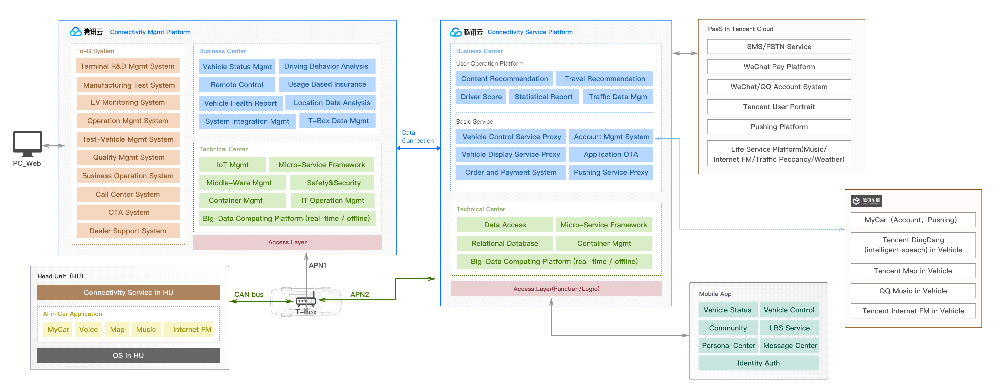

*Note: If you are interested in any project, please email me to request project slides for more detailed information.*

* **Arrival Time Estimation using Deep Neural Network**  
*key words: deep learning, spatial-temporal forecasting*  
Abstract: Vehicle travel time estimation or estimated time of arrival (ETA) is one of the most important
location-based services (LBS) because it largely determines the performance of route planning, traffic
monitoring, ride-sharing, taxi dispatching. Our Approach and contributions: 1. Propose a novel endto-end deep learning framework for bus ETA problem. Leverage CNN and LSTM, it can capture the
hidden spatial and temporal pattern from the trajectory, including the spatial relationship between
bus intervals and sequence relationship among different bus stops. Moreover, the multi-task learning
framework can boost the performance of ETA learning by utilizing a traffic speed prediction auxiliary
task which learns from traffic sensor data. 2. To the best of our knowledge, this is the first paper
utilizing all bus route trajectory data for a prediction model in a city to improve the ETA accuracy
for a particular route. 3. To solve the low-frequency problem of bus trajectory, we propose a data
augmentation system and related algorithm to solve this problem. 4. We open source of the code
of DeepBus model and Data Augmentation System and algorithm. We believe this will benefit the
practitioner and researcher in this domain.

* **USC IMSC Machine Learning and Data Computing Platform**    
*key words: machine learning system*   
Abstract: I proposed and designed a generic data computing platform for health care, autonomous driving,
media and entertainment, and smart cities. The core functions of this platform are the following
four aspects. 1) Pipeline Visualization: it can support UI for researcher and engineer to create a
pipeline to do computing. A node in the UI pipeline means a computing component such as "MySQL
to HIVE", "Spark Streaming Task", etc. Developers only concentrate on the computing task code
but not worrying about the complex script to connect different steps as you mentioned. 2) Dataset
Management: manage different dataset. When you need some data, just config a path or choose a
type in the UI system. Don’t need to care about how to manage this dataset. All works are done
on the cloud side but not the local. 3)ML algorithms sharing: everyone doesn’t need to implement
some baseline algorithms repeatedly, which can help us to improve efficiency. 4)Feature Engineering:
means extract features and reuse for further research and also for sharing in different computing
task. Reduce unnecessary repeatedly computing. To manage features. All in all, this kind platform
is a generic data science platform which is very similar to AutoML (one of Feifei’s job in Google) or
Petuum (Eric Xing’s startup). In the research perspective, we plan to publish a paper titled like this:
"TrafficML: A Democratizing and Scalable Machine Learning System for Intelligent Transportation".

* **Data Computing platform for the Internet of Vehicles**  
*key words: Cloud Computing, Machine Learning, Large-Scale Distributed System, Spark, HIVE, HDFS, Spring Cloud, Android SDK*

      
    Abstract: When I worked for Tencent, I led a Research and Development team including 10+ back-end and ML
algorithms software engineers to developed a cloud platform and data mining system for automotive
manufacturers. It can integrate the location data and the user profile data from manufacturers,
WeChat, QQ, and other Tencent’s products, The core research topics include the driving behavior
analysis, transportation demands prediction, vehicle intelligent dispatching, and large-scale trajectory
analysis.

* **Road Network Mining Based on Large-Scale Location Data**  
*key words: real-time computing, STORM, machine learning, large-scale location data*

      
    In real world, to provide accurately Location Based Services(LBS) for the Internet services like
WeChat, QQ, Didi and Tencent Maps, the route network data in our LBS system should be updated
3
timely to ensure the map and navigation application to calculate the best route (the shortest distance;
the least time-consuming; the route avoiding traffic congestion). I built a real-time distributed system
based on Storm framework to monitor the change of road network by processing the real-time location
data mainly collected through WeChat and Didi. Through this system, we can automatically update
the route network timely (only 1-2 hours even less time) and recognize nearly 80 percentage of the
new route opening event. To improve the accuracy of the data mining system, I used the Random
Forest machine learning algorithm to train the historical vehicle trajectory data.

* **Real World Map Rendering Engine for Location-Based Mobile Game**  
  
*key words: graphic rendering, c++ cross-platform library, mobile game*  
    Abstract: Pokemon-Go like mobile location game emphasizes the gameplay experience in the hybrid of GPS
location-based real world and virtual game setting. Designing the real world map rendering engine
for this location-based mobile game is challenging because the conventional C++ map rendering
engine is specially designed for route navigation applications which have different map rendering and
map data loading mechanism and it also doesn’t demand high rendering performance since its map
manipulation is much less intensive than gameplay setting. One natural method to solve this problem
is to redesign and implement an Unity3D-based map rendering engine for the game industry, but
it is impractical and time-consuming because it heavily relies on collaboration between researchers
and engineers from both the map industry and the game industry and neglects years of engineering
experiences in conventional map rendering engine. In this paper, we propose a novel hybrid realworld map rendering engine architecture for the location-based mobile game. This hybrid engine
design can efficiently and expeditiously inherit advantages of conventional c++rendering map engine
and Unity3D game framework and simultaneously have a high-performance guarantee in the game
setting. We first design a coordinate transformation framework and APIs to project the real world
map coordinate system to the virtual game setting and then merge the double-thread rendering
mechanism in conventional map engine to Unity3D rendering framework. Mean-while, we introduce
our performance optimization methods with the focus on GPU rendering performance. Primarily,
we propose an FPS-optimization algorithm by reducing the number of OpenGL draw calls from
more than 200 to less than 10. We evaluate overall performance metrics in hundreds of different
4
performance iOS and Android smartphone devices. The result shows this hybrid engine can gain
high-performance metrics with 40-60 FPS, less than 22M memory consumption, and less than 15
percentage CPU usage.

* **Speech Recognition System for Connected and Autonomous Vehicles**  
  
*key words: speech recognition, deep learning, mobile development*  
    Abstract: One of the challenges of In-Vehicle Operating System is the Voice Activity Detection. It is a technology to help the speech recognition system to judge when the speech begins and when it ends. It
is challenging because the in-vehicle environment is more complex than the usual environment such
as the smart home which doesn’t have too much noise background. In this work, I proposed a Deep
Neural Network(DNN) architecture to solve this problem. Its input is a feature engineering system
which can extract more than 100 features from the human speech in the in-vehicle environment.
DNN-based VAD has demonstrated good performance and has shown strong potential in practice.
Another contribution to this problem is that I designed a speech semantic analysis engine running on
the mobile device which can help to quickly fix some bad cased from the natural language processing
service. In practice, by analyzing the user experience feedback from our users, we may discover some
bad cases of semantic recognition. These cases contain domain error, outdated POI/Music data,
and polyphonic character. For example, the query spoken by user comes from navigation domain is
recognized as music domain. Although we can optimize or fix some bad cases by training data and
then update the semantic model in the cloud service, it is time-consuming. To quickly fix these bad
cases, we develop a semantic analysis engine running on the mobile side.

* **TAI: An Intelligent Automotive Operating System and Open Platform**  
  
*key words: operating system, system architecture design, system performance optimization, mobile computing, c++ cross-platform engine*   
    Abstract: TAI(Tencent Automotive Intelligence) is an automotive operating system or In-Vehicle Infotainment(IVI) running in the head unit in Internet-connected and autonomous vehicles. It aims to
provide the safer and easier ways for drivers to control over maps and GPS navigation, music, messaging from WeChat, and HFP telephony, mainly including conversational voice speech recognition,
Bluetooth remote steering controller, and driver friendly HMI(Human Machine Interface). We started
this project in December 2014. According to our experiences in the past four years, there are several
technical challenges to fulfill such an AI-based operating system in the vehicular environment: 1)
How to build our TAI system as a open and cross-platform operating system to support third-party
software applications and simultaneously adapt our operating system to heterogeneous hardware and
software platforms in different vehicles 2) As an Internet-Connected and Speech-based OS, how to
design and implement stable system-level Internet and speech services to meet the requirements from
different applications 3) How to provide a stable and high-performance mobile-vehicle link service for
drivers to synchronize the personal data between the smartphone and our TAI in-vehicle system. To
solve these problems, we propose a genetic open and cross-platform framework and API paradigm for
connected and autonomous vehicles. We name it as TAIFramework. TAIFramework contains three
main parts: a cross-platform layer named WeCarPlatform which is an open platform framework
to support different hardware platforms and also third-party applications, an Internet service layer
named WeCarCoreService which provides common system-level services for applications, a genetic
HMI library name WeCarCommonUI which standardizes the HMI components in this system. Meanwhile, we introduce our design and implementation of several critical system-level services, including
WeChat MyCar, speech recognition, Bluetooth remote controller, and OTA(Over The Air) software
upgrading. Moreover, we introduce our mobile-vehicle link SDK which can provide a stable and
high-performance communication connection to support data synchronization between smartphone
and TAI system. We also summarize the evaluation of software quality and performance of this
system. Finally, we share our lessons and experiences in the process of research and development
TAI.

* **Mobile and In-Vehicle Maps**  

  
*key words: system architecture design, system performance optimization, mobile computing, c++ cross-platform engine*  
    Abstract: Mobile maps and navigation system is a representative and fundamental Location-Based Service(LBS)
in the era of mobile Internet. According to the past few years research and development experience
in Baidu Maps and Tencent Maps, we propose TMAP framework, a system framework for mobile
maps and navigation system with high performance, high stability, and high scalability. TMAP
framework defines the best practice for the entire mobile system. In the application layer, TMAP
suggests a model-view-presenter-observer(MVPO) design pattern. In the SDK layer, TMAP utilizes
Director Finite State Machine(DFSM) framework to solve the unstable interactive problem that the
navigation process will experience excessive states from the UI layer and excessive events from map
and navigation engine. For the C++ Map Engine, TMap defines a vector map rendering engine
architecture and also shows how to design a multi-screen high-performance rendering system. In the
C++navigation engine layer, TMap focuses on the film director system design pattern. In the crossplatform layer, TMAP incorporates a well-design cross-platform framework to meet the demands of
supporting multiple operating systems, including Android, iOS, Linux, WinCE, and QNX. TMAP
proves to be the best practice for mobile maps and navigation system since it already supports a
5
variety of Location-Based Services(LBSs) with more than 100 million Internet users in China, including taxi-hailing applications, automotive maps, and the map service for connected and autonomous
vehicles. In this paper, we summarize our research and development experience of mobile maps
and navigation system as TMAP framework, and we describe the design and implementation of this
entire system framework and all layers including the application layer, SDK layer, C++ map and
navigation engine layer, and cross-platform layer.

