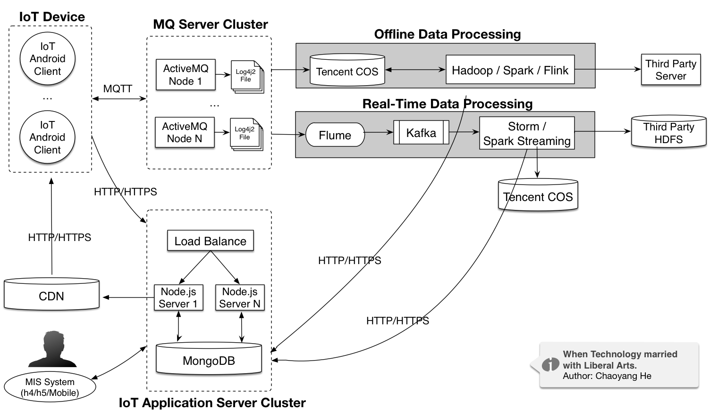
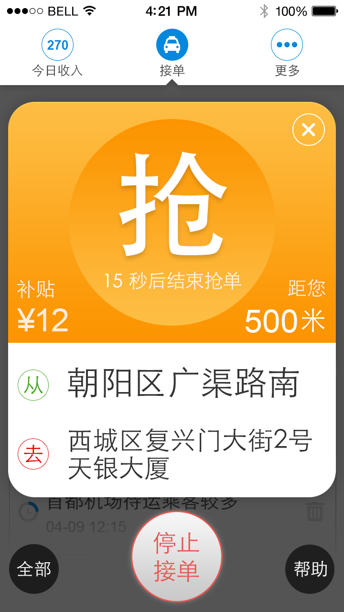
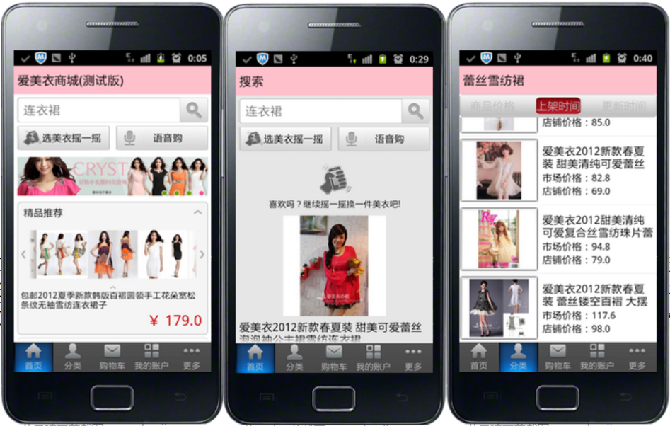
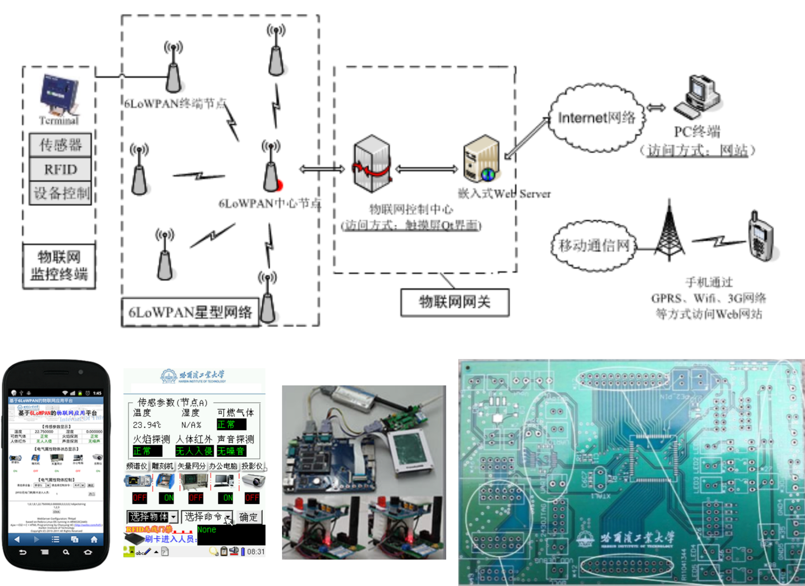

*Note: Although I am mainly focusing on scientific research now, I will keep an eye on entrepreneurship in the long run.*

* **IoT Data Computing Platform, 2018-present**  
    

* **Taxi-Calling Mobile Application and Service, 2013-2014**  
    

* **Mobile Shopping: Clothing Recommendation, 2011-2012**    
*Key Words: Android2.2(API 8); CakePHP + PHP + MySQL + Nginx + Linux; JSON + RESTful API*   

    

* **Web Management System Startup: Focusing on Content Management System(CMS), 2007-2009**

Miscellaneous
======  
* **Research and implementation of an Internet of Things application platform based on ZigBee and 6LoWPAN, 2011**   
*Key Words: ARM, C/C++, Embedded Web Server, Hardware, PCB, ZigBee, Wireless Communication* 
    